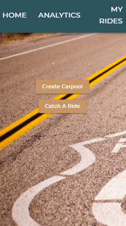
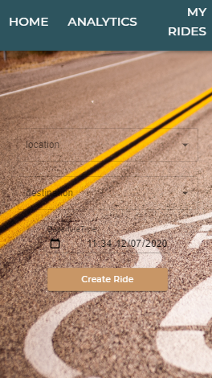
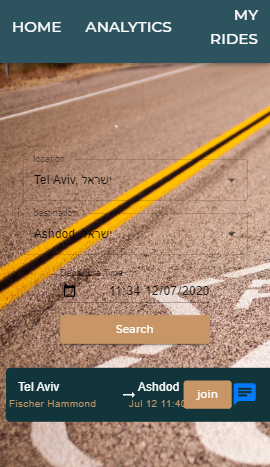
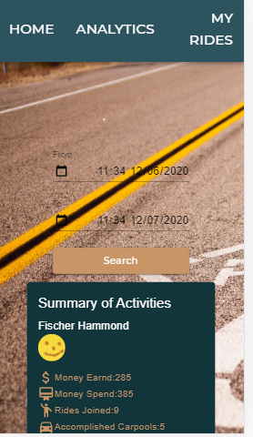
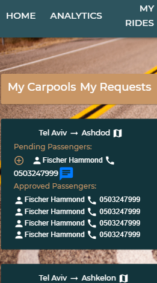

# OneRoad
One Road is carpool mobile responsive-App.The app give a win win solution to car owners that want to save money and people that don't have car but need to travel somewhere.
## Table Of Contents
- [OneRoad](#OneRoad)
  * [Running the project](#running-the-project)
  * [Screenshots](#Screenshots)
    + [Landing-page](#Landing page)
    + [Createride](#Create ride)
    + [Catchride](#Catch ride)
    + [Analytics](#Analytics)
    + [Carpools](#Carpools)
    + [Requests-for-ride](#Requests for ride)
    + [Map-and-ride-info](#Map and ride info)
  * [Tech-Stack](#Tech Stack )
  * [TODO](#todo)

## Running the project

1. Clone the repo
2. Run npm install
3. Run npm run build
4. Run npm start
5. Navigate to http://localhost:3000/Landing

## Screenshots

### Landing page
Home page of the app. If you are a driver, by clicking on the button  - create a ride - you can create a driving route that you "invite" potential passengers to join you.If you want to join the ride, by clicking on the button  - Catch a ride you can choose a route to join

### Create ride
Choose a start point, end point, and time for the route. And create a new ride.

### Catch ride
Choose a location that you can join to ride,date and destination.and choose ride to join.

### Analytics
Displays the summary of your activity in the app for a specific period you select.
Money  made, money  spent, number of trips you joined and number of trips you made.

### Carpools
Details of all the trips you created as a driver.
Introducing you:
People waiting to join.
People you approved for ride.
ride route.
You can also contact the passenger either via chat or by phone displayed on the screen.

### Requests for ride
Displays your applications to join.
rides that are still awaiting approval and those that have already been approved.

### Map and ride info
Displays the route, cost distance per passenger. In addition on this page the driver can announce the end of a trip.

## Techstack
1. React,Mobx, Material-UI and Axios,Google-Maps-Api.
2. Express (Node.js), Sql-Mysql,Socket-io.

## TODO
1. Create starting and ending points that can include more accurate addresses,
   such as street names and house numbers.
2. Create  sign up page.
3. Create intermediate points in a route with a distance restriction from the main  route.
4. Adding the option of creating a route by the passenger.

